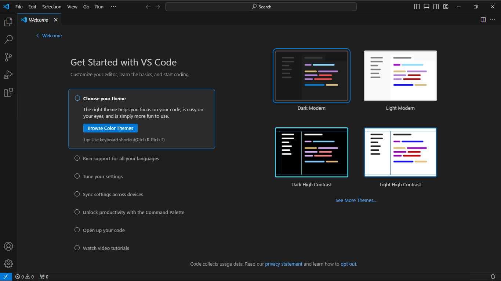

# Visual Studio Code Setup
written by Brandon Scholten
## Getting Started
Visual Studio Code is perhaps the best piece of software Microsoft has ever created, and it wil become your best friend as you advance on your journey in computer science. Visual Studio Code allows you to edit text files (specifically those containing source code) of nearly any type, and has a plethora of extensions which will make your life easier as a programmer. 

To Acquire your copy of VS Code, click [here](https://code.visualstudio.com/download).

Once you have the correct file for your operating system downloaded, double click the file to launch the installer for your operating system. 

After the install completes, you should be able to open VS Code as an application. Once open, you will be presented with the following screen:



Along the right side of the display there are several icons which allow for different functionality. 

The first icon will open a file browser that allows you to open a specific folder. Once a folder is opened, you can right click in this pane to do things such as create files and subfolders. 

The search icon allows you to search through your code and has a find and replace feature. 

The third icon is used for source control This allows for source control using Git.If you install Git on your system and open a folder which is under source control, this pane will allow you to do things such as make commits and push to rmeote repositories. If you don't know what source control is click [here]().

The icon with a play button provides options for debugging in folders which have a correctly configured `launch.json` file. For more information about debugging with VS Code click [here]()

The icon with four squares allows you to install extensions which add extra features to visual studio code. Extensions can do a wide variety of things. Some extensions I use in my own setup include a PDF reader, live preview (for web development), and live preview of markdown files. 

## Getting a Compiler

### What's a compiler?

In English, to compile is to produce something from various sources. In C++, to compile is to produce an executable from various source code files. The compiler is the piece of software that is used to turn your code into something that can be ran on your computer. 

### Setting up a compiler in VS Code

Even though VS Code is the best piece of software Microsoft has ever written, they forgot to include a compiler for C++. To install the compiler, we will need to install one ourselves. 

#### Windows

1. Start by downloading [this installer](https://github.com/msys2/msys2-installer/releases/download/2024-01-13/msys2-x86_64-20240113.exe) for MSYS2. This will provide us with everything we need to compile C++ files to run on Windows. 

2. Run the installer by opening the downloaded file. It should look like this:

3. When prompted to select an installation folder, the default value should be fine. However, <b>be sure to make a note of the installation path as it will be used later.</b> 

4. Continue with the installation until you get to the following screen. Leave the "Run MSYS2 now." checkbox selected and click "Finish".


5. A terminal will then open. Copy and paste the following command into the terminal and press enter: `pacman -S --needed base-devel mingw-w64-ucrt-x86_64-toolchain`. This command will start the installation of the MinGW toolchain. This installs the specific packages required to compile C++ into an executable that is compatible with Windows.
    - When prompted to "Enter a selection", press enter.
    - When prompted whether to proceed with the installation, press Y and then enter. 
    - Once the command finishes, you will officially have a compiler. (Congratulations!)

6. Unfortunately for us, whoever wrote the installer for WinGW decided not to finish their work. So we will have to tell Windows ourselves where to find it. This can be done in Settings:
    - Open Settings 
    - search for "environment variables" and select "Edit environment variables for your account". 
    - You should see this window: 
    - In the top pane, select "Path" and then click the "Edit" button.
    - In the window that pops up, click "New" and enter the installation path you took note of earlier. 
    - Once this installation path is added to path, select "Ok" in both of the currently open dialog windows.

#### MacOS

Mac users have a much easier life. The GCC compiler as well as the other tools nessecary to compile C++ for MacOS can be installed in two steps:

1. use cmd + space to open spotlight search (or click the magnifying glass by the Wi-Fi icon in the top right corner) and type "terminal". Open the terminal application.

2. type `gcc` and press enter. If you don't already have the GNU compiler installed, you will see a window prompting you to install the command line developer tools. Click install, enter any credentials you are prompted for, and wait for the install to finish. 

## Using the Compiler

Now that we have a compiler, we can open VS Code and get to work. Here is how to compile C++ source code without touching the commmand line. 

### Install C++ Extension

1. In Visual Studio Code, open the extensions menu and search for C++. 
2. Install the extension that looks like this the image below. This extension should be authored by Microsoft. 

### Hello World!

With the C++ extension installed, we should be able to use VS Code with the GNU compiler. 

1. Create a new folder and open it using the file explorer pane in the side bar. 
2. Create a new file called `hello.cpp`
3. copy the following code into the file:
    ```cpp
    #include <iostream>
    int main() {
        std::cout << "Hello World!" << std::endl;
    }
    ```
4. With the C++ file you want to compile open, click the play button in the upper right corner. You should see your program run in the terminal below!

### Common Issues

If you instead are seeing an error, here are a couple of things you may need to adjust for VS Code to work. 

1. Check that VS Code is configured to use the GCC compiler.
    - click the search bar and type `>debug`
    - Select the option to add a debug configuration
    - Select the option for GCC

2. Check that the path used to access the compiler is the same as the installaiton path from earlier. 
    - In the file explorer open .vscode > tasks.json
    - Ensure that the file path being used for "command" is the same as the installation path for MSYS2. 
