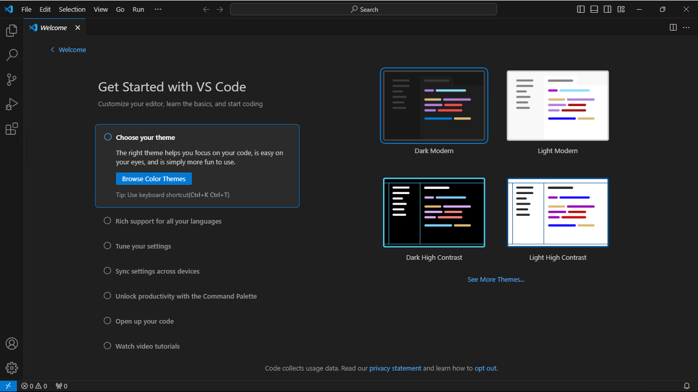

# Visual Studio Code Setup
written by Brandon Scholten 
## Getting Started
Visual Studio Code is perhaps the best piece of software Microsoft has ever created, and it wil become your best friend as you advance on your journey in computer science. Visual Studio Code allows you to edit text files (specifically those containing source code) of nearly any type, and has a plethora of extensions which will make your life easier as a programmer. 

To Acquire your copy of VS Code, click [here](https://code.visualstudio.com/download).

Once you have the correct file for your operating system downloaded, double click the file to launch the installer for your operating system. 

After the install completes, you should be able to open VS Code as an application. Once open, you will be presented with the following screen:



Along the right side of the display there are several icons which allow for different functionality. 

The first icon will open a file browser that allows you to open a specific folder. Once a folder is opened, you can right click in this pane to do things such as create files and subfolders. 

The search icon allows you to search through your code and has a find and replace feature. 

The third icon is used for source control This allows for source control using Git.If you install Git on your system and open a folder which is under source control, this pane will allow you to do things such as make commits and push to rmeote repositories. If you don't know what source control is, click [here]().

The icon with a play button provides options for debugging in folders which have a correctly configured `launch.json` file. For more information about debugging with VS Code click [here]()

The icon with four squares allows you to install extensions which add extra features to visual studio code. Extensions can do a wide variety of things. Some extensions I use in my own setup include a PDF reader, live preview (for web development), and live preview of markdown files. 

## Connecting to Wasp and Hornet

As a computer science student you are provided access to your very own linux virtual machine hosted on a server. This virtual machine provides everything you need to code and run your C++ projects (if you are comfortable using the terminal).

In CSI, CSII, and CSIII, it is generally a good idea to ensure that your C++ projects compile on your linux virtual machine. In fact, this is often an important part of the criteria upon which your projects and labs are graded. 

In years past, it was common for the Wasp and Hornet servers (where student virtual machines live) to be accessed using a terminal emulator such as PuTTY. In this scenario, the terminal would be used exclusively to manipulate files and compile code. 

To make life slightly easier, we can open an SSH connection to Wasp or Hornet using VSCode and work with the files in the remote virtual machine as if they were stored locally. 

### Open a Remote Connection

To open a remote connection to a server in VS Code:

1. Click the icon at the very left on the status bar at the bottom of the screen
2. Select SSH in the menu at the top of the screen. (Click or use arow keys and press enter)
3. Wait for the extension to finish installing
4. Enter your flashline username, followed by an at symbol, followed by the server address, and press enter. 
    - type `username@server.cs.kent.edu`
    - replace `username` with your flashline username
    - replace `server` with either `wasp` or `hornet`
5. Select Linux when prompted for the platform of the remote host.
6. When prompted about a fingerprint, select continue
7. When prompted for a password, enter your flashline password

Once you have completed the steps above, you may notice a message in the bottom right corner letting you know that visual studio code is being installed on the remote host. Once this finishes, you should have access to your virtual machine. 

### Create and Edit Files and Folders

Once connected to the virtual machine, open the file browser and select "open folder". This will display a popup with the folders in your virtual machine. Selecting the ok button in this popup wihtout selecting any of the folders will open your home folder. This is where you should save folders for each of your classes. 

You may be prompted to enter your password again before the home folder opens. Once the folder is open, you may be propmpted again with a message asking whether you trust the authors of the folder. Assuming you have followed the steps above, it should be safe to select "yes, I trust the authors."

At this point, you can begin manipulating files in the server just as you would on your computer using VS Code. 

Creating a new folder with a file in it:
1. right click in the file explorer and select "New Folder"
2. Name the folder
3. Right click on the folder and select "New File"
4. Name the file. Make sure to include the extension for whatever language you are using. For C++ files the extension will be `.cpp`.

### Compile and run C++ Files

The compiler included with your virtual machine is GCC (GNU Compiler Collection), and is used to compile your C++ files into executable files. Below is an example of how the g++ compiler can be used to compile C++ files. 

```
g++ yourFile.cpp #compile the C++ file
./a.out          #run the compiled file (assuming successful compilation)
```

